# 🛍️ CMS для интернет-магазина

**CMS для управления интернет-магазином с поддержкой нескольких магазинов.**  
Через административную панель можно управлять товарами, баннерами, категориями, пользователями, заказами и подарочными сертификатами.  

---

## 📊 Панель управления

На главной странице отображается статистика магазина:  
- 💰 Общая сумма доходов  
- 🛒 Количество заказов  
- 🏷️ Количество товаров  
- 📈 График доходов по месяцам  

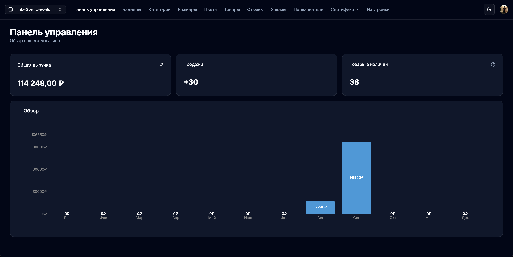

---

## 🖼️ Баннеры

- 🔍 Поиск по названию баннера  
- ➕ Добавление нового баннера  
- Таблица с колонками: название, дата создания  
- Действия: копировать ID, редактировать, удалить  

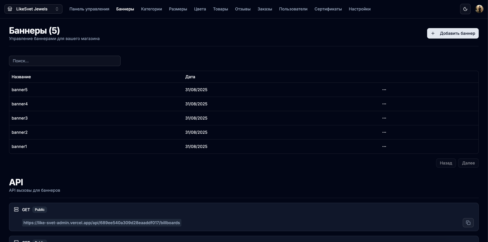

---

## 🗂️ Категории

- 🔍 Поиск по названию категории  
- Таблица с колонками: название, дата создания  
- Действия: копировать ID, редактировать, удалить  
- Для подарочных сертификатов обязательно название категории **Подарочные сертификаты**  

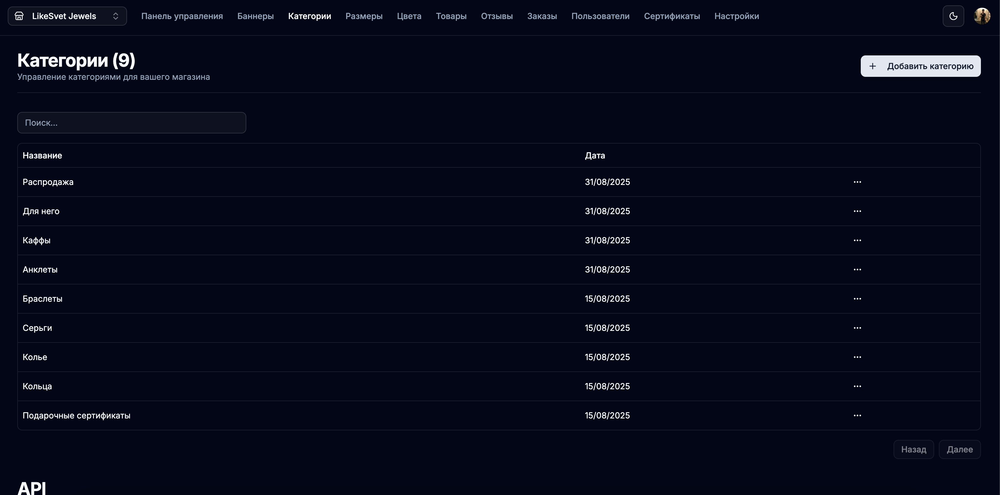

---

## 📏 Размеры

- 🔍 Поиск по значению размера  
- Таблица с колонками: название, значение (например: `22mm`), дата создания  
- Меню действий:
  - Редактировать размер  
  - Удалить размер  
- При добавлении или редактировании размера необходимо указать название и значение.

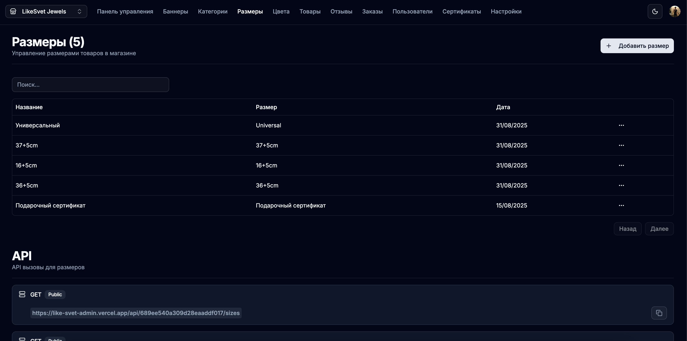

---

## 🎨 Цвета

- 🔍 Поиск по названию цвета  
- Таблица: название, цвет (CSS), дата создания  
- Действия: редактировать, удалить  

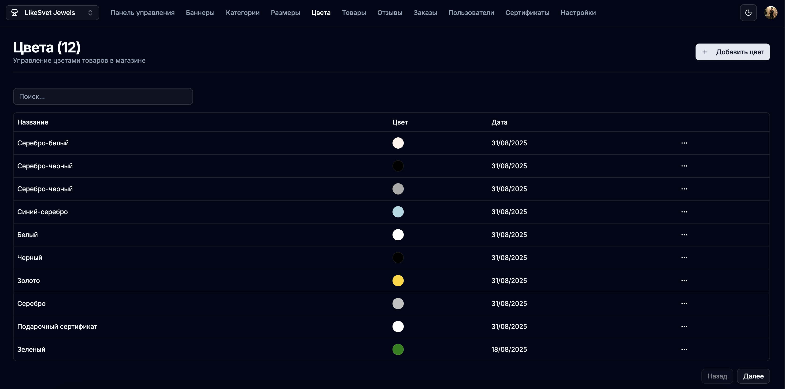

---

## 🛒 Товары

- 🔍 Поиск по названию товара  
- Таблица: название, архивирован, рекомендованный, цена, категория, размер, цвет  
- Действия: редактировать, удалить  
- При создании/редактировании:
  - Загрузка изображений  
  - Название и цена  
  - Выбор категории, размера, цвета  
  - Опции: рекомендованный товар, архивировать, подарочный сертификат  

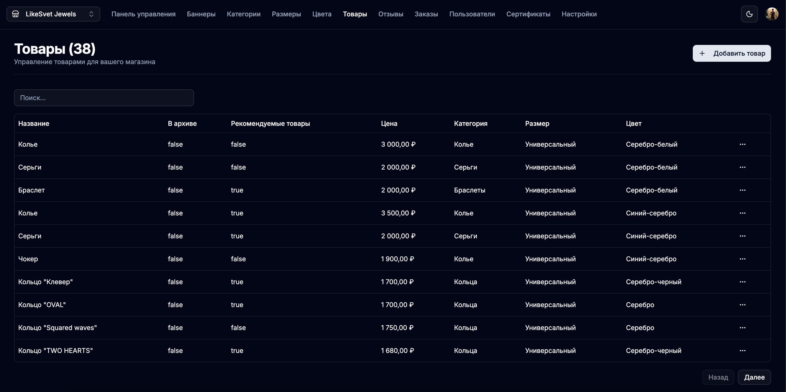

---

## ⭐ Отзывы

- 🔍 Поиск по названию отзыва  
- Таблица: название, дата создания  
- Действия: редактировать, удалить  

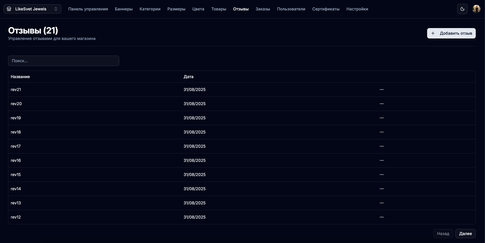

---

## 📦 Заказы

- 🔍 Поиск по контактам покупателя (телефон или e-mail)  
- Таблица: ID, ФИО, контакты, способ доставки, адрес доставки, список товаров, общая сумма, статус оплаты, дата  
- Просмотр деталей заказа  

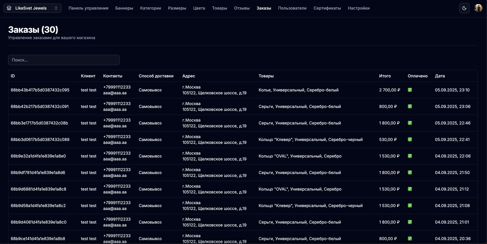

---

## 👤 Клиенты

- 🔍 Поиск по контактам (телефон или e-mail)  
- Таблица: ФИО, контакты, баланс, дата регистрации  
- Действия: редактировать, копировать ID, удалить  

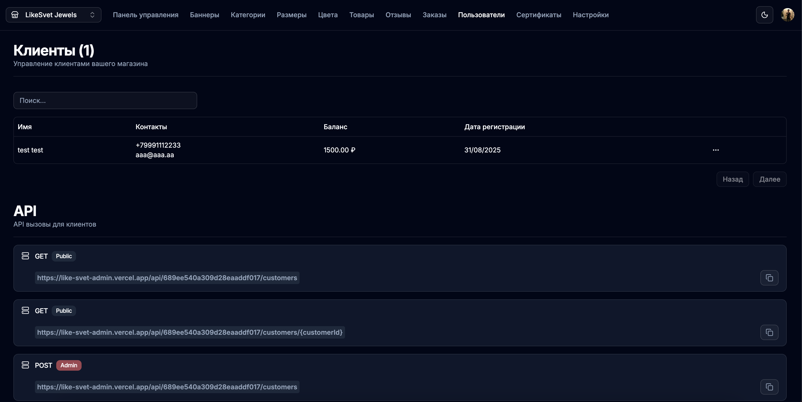

---

## 🎁 Подарочные сертификаты

- 🔍 Поиск по коду сертификата  
- Таблица: код, номинал, дата покупки, дата окончания, кем куплен, статус, кем активирован  
- Действия при создании/редактировании: код, номинал, дата окончания, включить/отключить сертификат  

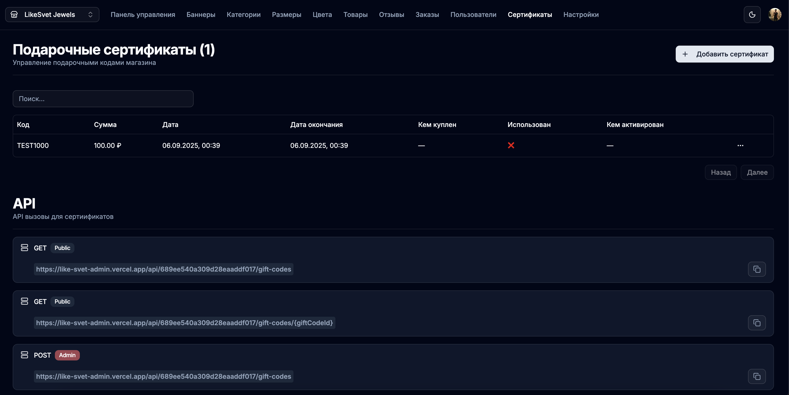

---

## ⚙️ Настройки магазина

- Изменение названия магазина  

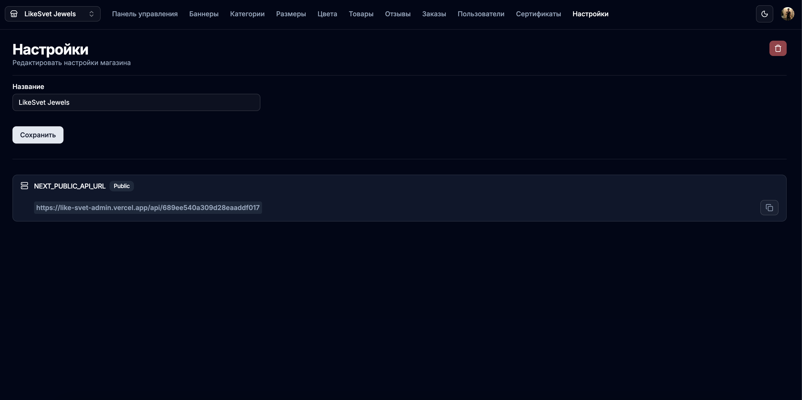

---

## 🧭 Навигация CMS

- Переключение темы: светлая, тёмная, системная  
- Выход через Clerk  
- Управление личным аккаунтом  
- Создание нового магазина (требуется участие разработчика)  


---

## 🔒 Безопасность

- Пароль-gate при входе в CMS  
- Авторизация через Clerk  

---

## 🛠️ Технологии

- **Next.js** – фронтенд и серверные функции  
- **Clerk** – аутентификация пользователей  
- **Prisma** – ORM  
- **MongoDB** – база данных  
- **Node.js** – серверная часть  

---

## 📦 Установка и запуск

```bash
git clone https://github.com/your-username/your-repo.git
cd your-repo
npm install
npm run dev
```


## Проект будет доступен по адресу:
👉 http://localhost:3000

---

## 👨‍💻 Автор

Antipin Vladimiro
📩 Контакты: antipinvladimiro@yandex.ru